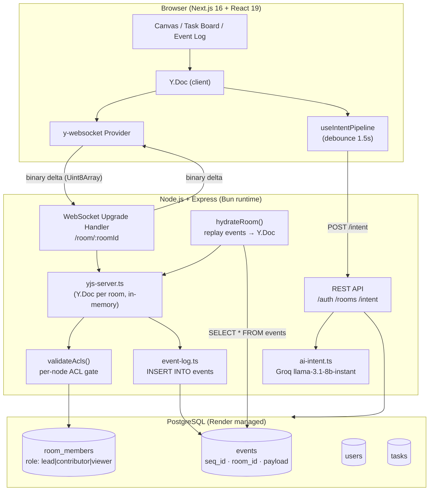

# LIGMA — Let's Integrate Groups, Manage Anything

A real-time collaborative infinite canvas with AI-powered intent classification, event sourcing, and fine-grained role-based access control.

---

## Live Demo

> **Server:** https://ligma-server.onrender.com  
> **App:** https://ligma-web.vercel.app  
> **Demo room (no login):** `/room/demo`

---

## Features at a Glance

| Feature | Details |
|---------|---------|
| **Infinite Canvas** | Sticky notes, shapes (rect/circle), freehand drawing, text blocks — all pan/zoomable |
| **Real-Time Sync** | Multi-user via WebSocket; sends binary Yjs delta updates, never the full document |
| **Cursor Presence** | Live labeled, coloured cursors for every connected peer via Yjs Awareness |
| **CRDT Merging** | Yjs — concurrent text edits merge automatically, no last-write-wins conflicts |
| **Node-level RBAC** | Lead / Contributor / Viewer per node, enforced server-side on every WS message |
| **AI Classification** | Groq LLM classifies node text → action item / decision / open question / reference |
| **Task Board** | Auto-populated from AI classifications, live for all users, links back to canvas node |
| **Event Log** | Append-only sidebar; every canvas mutation appears in real time |
| **Reconnect Replay** | Server rehydrates Y.Doc from Postgres event log on reconnect — no state lost |
| **Time-Travel Replay** | Scrub through the full room history with play/pause and arrow-key stepping |

---

## Architecture



### Key Data Flow

1. **User types on a sticky note** → Yjs records the character insert as a CRDT operation → `y-websocket` serialises it as a binary delta → sent over WebSocket to server.
2. **Server receives delta** → `validateAcls()` clones the doc, applies the candidate update, diffs node states before/after → if any forbidden mutation is detected the update is **dropped** and a corrective sync is sent back.
3. **Validated update** is applied to the canonical server-side `Y.Doc` via `Y.applyUpdate(doc, update, ws)` → the `update` event fires → every *other* connected client's handler relays the binary delta to their socket.
4. **Persistence** → the originating client's handler also calls `logEvent()` which `INSERT`s the raw base64-encoded update into the `events` table.
5. **Reconnect** → on the next connection to the room `hydrateRoom()` fetches all `events` rows and replays them into a fresh `Y.Doc` — the SyncStep1/2 handshake then gives the reconnecting peer only the delta it's missing.
6. **AI pipeline** → after 1.5 s of inactivity on a text node `useIntentPipeline` calls `POST /intent` → Groq returns `{ label, confidence }` → the label is written back into `node.classification` on the shared Y.Doc → if `action-item`, a task object is pushed into `room.tasks` (Y.Array) → `TaskBoard` re-renders for every peer.

---

## Why Yjs / CRDT Instead of OT

### The Problem With Last-Write-Wins

Naïve collaborative systems resolve conflicts by timestamp: whoever sent the last update wins. This is simple but catastrophic for text: if Alice and Bob both type at position 5 simultaneously, one edit silently overwrites the other — data loss every time two users are in the same sentence.

### Operational Transformation (OT) — The Old Answer

OT (used by early Google Docs) transforms concurrent operations relative to each other before applying them. It works, but requires a central server to serialise operations and a complex transformation function for every pair of operation types. It is notoriously hard to implement correctly and does not compose well with offline support.

### CRDTs — The Modern Answer

A **Conflict-free Replicated Data Type** is a data structure designed so that any two replicas can be merged in any order and always converge to the same result — with **no coordination required**.

Yjs implements a CRDT called **YATA** (Yet Another Transformation Approach). Each character insert is assigned a globally unique logical timestamp `(clientId, clock)`. When two concurrent inserts happen at the same position:

- Both are kept — no data is lost.
- The merge order is deterministic: ties broken by `clientId`, so every peer independently reaches the same final string without talking to a server.

```
Alice inserts 'A' at position 5  →  op: { id: (alice,1), origin: char_at_4 }
Bob   inserts 'B' at position 5  →  op: { id: (bob,1),   origin: char_at_4 }

After merge on both peers: "...char_at_4  A  B ..."  (or B A — deterministic, consistent)
```

### What Yjs Gives Us Specifically

| Yjs type | Used for | Why |
|----------|----------|-----|
| `Y.Text` | Sticky note / text block content | Character-level CRDT — concurrent edits always merge |
| `Y.Map` | Each canvas node's properties | Key-value CRDT — last-write-wins per key is acceptable for position/size |
| `Y.Array` | Task list, event entries, stroke points | Append-oriented — items are never re-ordered after insert |
| **Awareness** | Cursor positions | Ephemeral state — not persisted, TTL-based cleanup |

The server holds one `Y.Doc` per room in memory. Every validated binary delta is applied with `Y.applyUpdate` and fanned out to peers. No custom merge logic was written — Yjs handles it all.

---

## Why Event Sourcing / Append-Only Log

### Traditional Approach — Mutable State

Most databases store *current state*: `UPDATE nodes SET x=100 WHERE id=...`. You always know where everything is right now, but you have **no history** — you can't answer "what did this canvas look like an hour ago?" or "who deleted that sticky note?"

### Event Sourcing — Store What Happened, Derive What Is

Instead of mutating state, we append an **immutable record of every mutation**:

```sql
-- events table
seq_id  | event_type  | room_id | user_id | payload
--------|-------------|---------|---------|----------------------------
1       | doc_update  | room-A  | user-1  | { update: "<base64 bytes>" }
2       | doc_update  | room-A  | user-2  | { update: "<base64 bytes>" }
3       | doc_update  | room-A  | user-1  | { update: "<base64 bytes>" }
```

The **current state is a projection** — you can always reconstruct it by replaying events 1…N in order. This is exactly what `hydrateRoom()` does on every server start or room creation:

```typescript
const history = await getEventsSince(roomId, 0);   // fetch all events
for (const event of history) {
  Y.applyUpdate(doc, base64ToUint8(event.payload.update));  // replay
}
// doc now reflects the complete history
```

### Why This Matters Here

| Property | Benefit |
|----------|---------|
| **Reconnect recovery** | Client reconnects → server already has full state from replayed events → SyncStep2 carries only the missed delta |
| **Time-Travel Replay** | Client records the same event sequence locally → slider scrubs through snapshots at any point in history |
| **Audit trail** | Every mutation is traceable to a `(user_id, timestamp)` — the Event Log sidebar renders this directly |
| **No data loss on crash** | Server restarts with empty in-memory state → first connection to any room replays Postgres → state is fully restored |
| **Immutability** | `seq_id` is a `BIGSERIAL` — rows are never updated or deleted. History is append-only by database design. |

---

## Node-Level RBAC

Every canvas node has an `acl` field: `"all"` | `"contributor+"` | `"lead-only"`.

On **every** incoming WebSocket mutation the server:

1. Clones the current `Y.Doc` into a throwaway doc.
2. Applies the candidate update to the clone.
3. Diffs `nodes` Y.Map before and after — finds which node fields changed.
4. For each structurally changed node, checks `canEditNode(userRole, node.acl)`.
5. If any check fails → **drops the update**, sends a corrective SyncStep1+2 back to the offending client so their local state snaps back to authoritative server state.

**Exception:** mutations that only touch a node's `comments` Y.Array are always allowed — even Viewers can comment on Lead-locked nodes (per spec).

Role changes propagate live: when a Lead PATCHes a member's role via REST, `broadcastRoleChange()` bumps `meta.membersVersion` on the shared Y.Doc. Every connected client's per-connection meta observer sees this and sets `roleCachedAt = 0`, forcing a DB re-fetch on the next message — live demotion takes effect within one round-trip, no reconnect needed.

---

## Repository Structure

```
ligma/
├── apps/
│   ├── web/                        # Next.js 16, React 19, Tailwind v4
│   │   ├── app/                    # App Router pages
│   │   │   ├── page.tsx            # Landing page
│   │   │   ├── login/ signup/      # Auth pages
│   │   │   ├── dashboard/          # Room list
│   │   │   └── room/[roomId]/      # Canvas workspace
│   │   ├── components/
│   │   │   ├── canvas/             # Canvas, nodes, toolbar, cursors, replay
│   │   │   ├── taskboard/          # TaskBoard.tsx — live Y.Array subscriber
│   │   │   ├── sidebar/            # EventLog.tsx — real-time mutation feed
│   │   │   └── workspace/          # Layout shell
│   │   └── lib/
│   │       ├── yjs.ts              # Y.Doc + WebsocketProvider singletons
│   │       ├── useIntentPipeline.ts # Debounced AI classification hook
│   │       ├── acl.ts              # Client-side ACL helpers (mirrors server)
│   │       └── api.ts              # Typed REST client
│   └── server/                     # Node.js + Express (Bun runtime)
│       └── src/
│           ├── index.ts            # HTTP + WebSocket server entry
│           ├── routes/
│           │   ├── auth.ts         # Signup/login/verify/reset/Google OAuth
│           │   ├── rooms.ts        # Room CRUD + member management
│           │   └── intent.ts       # POST /intent — AI classification endpoint
│           ├── services/
│           │   ├── yjs-server.ts   # Y.Doc lifecycle, RBAC gate, fan-out
│           │   ├── rbac.ts         # Role + ACL helpers
│           │   ├── event-log.ts    # Append-only INSERT + replay query
│           │   ├── ai-intent.ts    # Groq API + keyword fallback
│           │   ├── email.ts        # Transactional email via Resend
│           │   └── otp.ts          # 6-digit OTP issuance + verification
│           └── db/
│               ├── schema.ts       # Drizzle ORM schema
│               └── client.ts       # Postgres connection
├── doc/
│   ├── PLAN.md                     # Hackathon master plan + work breakdown
│   └── USER_ONBOARDING.md
└── README.md                       # This file
```

---

## Database Schema

```sql
-- Immutable event log (source of truth for Y.Doc state)
CREATE TABLE events (
  id         SERIAL PRIMARY KEY,
  seq_id     BIGSERIAL NOT NULL UNIQUE,   -- monotonic, never reused
  room_id    UUID NOT NULL REFERENCES rooms(id),
  user_id    UUID REFERENCES users(id),
  event_type VARCHAR(50) NOT NULL,        -- 'doc_update'
  node_id    TEXT,
  payload    JSONB NOT NULL,              -- { update: "<base64 Yjs binary>" }
  created_at TIMESTAMPTZ DEFAULT NOW()
);

-- Room membership with roles
CREATE TABLE room_members (
  room_id UUID NOT NULL REFERENCES rooms(id),
  user_id UUID NOT NULL REFERENCES users(id),
  role    TEXT NOT NULL,                  -- 'lead' | 'contributor' | 'viewer'
  PRIMARY KEY (room_id, user_id)
);

-- Task board items (linked to canvas nodes, never duplicate text)
CREATE TABLE tasks (
  id          UUID PRIMARY KEY DEFAULT gen_random_uuid(),
  room_id     UUID NOT NULL REFERENCES rooms(id),
  node_id     TEXT NOT NULL,             -- foreign key into Y.Doc nodes map
  author_id   UUID REFERENCES users(id),
  author_name TEXT NOT NULL,
  status      TEXT NOT NULL DEFAULT 'open',  -- 'open' | 'done'
  created_at  TIMESTAMPTZ DEFAULT NOW()
);
```

---

## REST API

| Method | Path | Auth | Description |
|--------|------|------|-------------|
| `POST` | `/auth/signup` | — | Create account, send OTP email |
| `POST` | `/auth/verify-email` | — | Redeem OTP → get JWT |
| `POST` | `/auth/login` | — | Credentials login → JWT |
| `POST` | `/auth/forgot-password` | — | Send password reset OTP |
| `POST` | `/auth/reset-password` | — | Redeem OTP → new password + JWT |
| `POST` | `/auth/google-upsert` | Shared secret | OAuth upsert (called by NextAuth) |
| `POST` | `/rooms` | JWT | Create room |
| `GET` | `/rooms` | JWT | List rooms caller is a member of |
| `GET` | `/rooms/:id` | JWT | Room metadata + members |
| `PATCH` | `/rooms/:id/members` | JWT (Lead only) | Change a member's role |
| `POST` | `/rooms/:id/join` | JWT | Join via share link |
| `GET` | `/rooms/:id/tasks` | JWT | Initial task list (live via Yjs after) |
| `POST` | `/intent` | JWT | Classify text → `{ label, confidence }` |
| `GET` | `/health` | — | Liveness probe |

**WebSocket:** `ws://host/room/:roomId?token=<jwt>&last_seq_id=<n>`  
Unauthenticated (guest) connections omit `token` and get a server-minted `guest_*` userId with contributor-level access in ephemeral rooms.

---

## Local Development

### Prerequisites

- [Bun](https://bun.sh) ≥ 1.3
- PostgreSQL 15+ (local or Docker)
- (Optional) [Groq API key](https://console.groq.com/keys) for real AI classification

### 1 — Install dependencies

```bash
bun install
```

### 2 — Configure environment

```bash
# Server
cp apps/server/.env.example apps/server/.env
# Fill in: DATABASE_URL, JWT_SECRET, GROQ_API_KEY (optional)

# Web
# Create apps/web/.env.local
echo "NEXT_PUBLIC_API_URL=http://localhost:8080" >> apps/web/.env.local
echo "NEXT_PUBLIC_WS_URL=ws://localhost:8080"   >> apps/web/.env.local
```

### 3 — Push database schema

```bash
cd apps/server
bun run db:push
```

### 4 — Run both apps

```bash
# From repo root — starts web (port 3000) and server (port 8080) concurrently
bun run dev

# Or individually:
bun run dev:web
bun run dev:server
```

Open [http://localhost:3000](http://localhost:3000).  
The demo room at `/room/demo` works without an account.

### 5 — Run server tests

```bash
cd apps/server
bun test
```

Tests cover: node ACL enforcement (`node-acl.test.ts`), RBAC role helpers (`rbac.test.ts`), and reconnect replay (`replay.test.ts`).

---

## Deployment (Render)

The `apps/server/render.yaml` defines the full Render stack:

```yaml
services:
  - type: web
    name: ligma-server
    env: node
    plan: free
    buildCommand: curl -fsSL https://bun.sh/install | bash && $HOME/.bun/bin/bun install
    startCommand: $HOME/.bun/bin/bun run src/index.ts
    healthCheckPath: /health
    envVars:
      - key: DATABASE_URL
        fromDatabase:
          name: ligma-db
          property: connectionString
      - key: JWT_SECRET
        generateValue: true
      - key: GROQ_API_KEY
        sync: false          # set manually in Render dashboard
      - key: PORT
        value: 10000

databases:
  - name: ligma-db
    plan: free
```

**Render supports WebSocket on the free tier** — the HTTP server upgrades the connection in-process via `server.on('upgrade', ...)`, so no separate WS port or proxy config is needed.

For the frontend, deploy `apps/web` to Vercel:

```bash
cd apps/web
vercel --prod
# Set env vars: NEXT_PUBLIC_API_URL, NEXT_PUBLIC_WS_URL → your Render service URL
```

---

## Keyboard Shortcuts

| Key | Action |
|-----|--------|
| `N` | New sticky note at canvas centre |
| `S` | Shape tool |
| `D` | Freehand draw tool |
| `T` | Text block tool |
| `Escape` | Deselect / cancel tool |
| `Delete` / `Backspace` | Delete selected node(s) |
| `H` | Toggle time-travel replay panel |
| `←` / `→` | Step backward/forward in replay |

---

## Tech Stack

| Layer | Choice | Reason |
|-------|--------|--------|
| Frontend framework | Next.js 16 + React 19 | App Router, SSR, dynamic imports for canvas |
| Styling | Tailwind CSS v4 | Utility-first, zero config |
| Canvas rendering | DOM nodes + CSS transforms | Full React event model per node, no hitbox math |
| CRDT | **Yjs** (yjs + y-websocket) | Production-grade, used by Figma/Notion internals |
| WebSocket | `ws` + y-protocols | Binary protocol, awareness for cursors |
| Backend | Express + Bun runtime | REST + WebSocket in one process |
| Database | PostgreSQL + Drizzle ORM | Type-safe queries, event log, RBAC |
| AI classification | Groq `llama-3.1-8b-instant` | JSON-mode, <300ms, free tier |
| Auth | Custom JWT + bcrypt + OTP | Zero cost, no third-party lock-in |
| Deployment | Render (server) + Vercel (web) | Free tier WebSocket support on Render |

---

## Design Decisions

### Why not use a hosted Yjs server (e.g. Hocuspocus)?

We need server-side RBAC enforcement — every mutation must pass through our ACL gate before being broadcast. A hosted Yjs server would bypass this entirely. Rolling our own `handleConnection` in `yjs-server.ts` gives us full control over the message lifecycle.

### Why store raw Yjs binary in the event log instead of semantic events?

Semantic events (`node_created`, `node_moved`) would require maintaining a separate schema that mirrors the Y.Doc structure — and staying in sync as the schema evolves. Storing the raw Yjs update binary means `hydrateRoom` can replay the *exact* CRDT history via `Y.applyUpdate` — the doc reaches the identical state without any translation layer. The Event Log sidebar derives human-readable descriptions from Y.js observers separately.

### Why in-memory Y.Doc per room instead of a database-backed CRDT store?

For hackathon scale (tens of concurrent users per room), in-memory is orders of magnitude faster than round-tripping to Postgres on every keystroke. Persistence is handled asynchronously by `logEvent()`. On server restart, `hydrateRoom()` restores state from Postgres in one bulk query before the first client can complete its SyncStep2 — so from the client's perspective, state is never lost.
